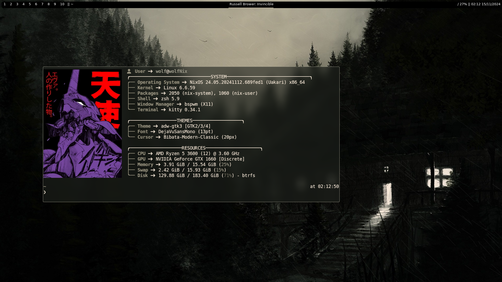
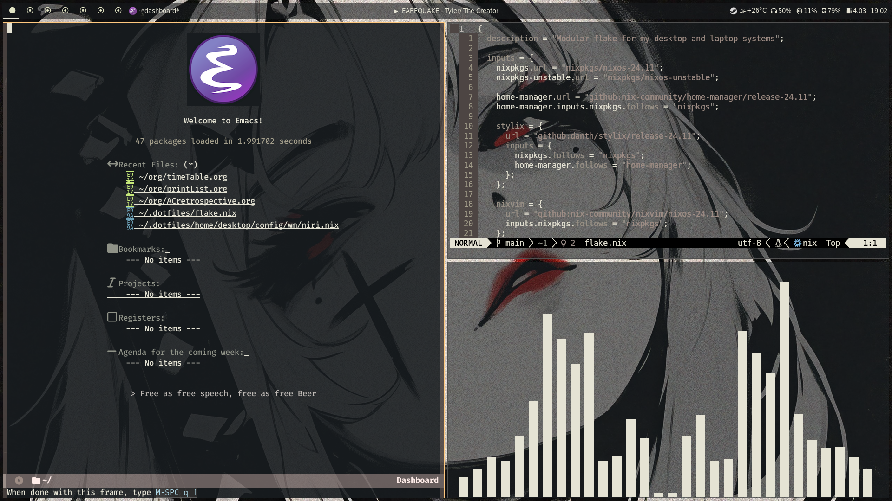

## my nixos configuration
- using [NixOS](https://nixos.org/), [Nix-Flakes](https://nixos.wiki/wiki/flakes)
  and [Home Manager](https://nix-community.github.io/home-manager/)
- two hosts, #desktop and #laptop for both my systems (you guessed it, a desktop and a laptop)
- massive work in progress, but did work in a VM with some minor configuration changes
  (GPU drivers)
<hr>

#### how it works
- the flake (flake.nix) is the core of the system, responsible for creating the 
  #desktop and #laptop hosts
- the hosts directory contains configuration relevant for both hosts seperately,
  as well as modules common to both hosts
- i use nh, a wrapper around standard nixos tools that provides
  attractive progress updates during rebuilds
- rebuilding system changes:
```
nh os switch -H desktop     # same as nixos-rebuild switch --flake .#<host>
```
- rebuilding home changes:
```
nh home switch -c desktop   # same as home-manager switch --flake .#<host>
```
<hr>

#### theme previews

theming possible through [stylix](https://stylix.danth.me/), a Nix project that
generates base-16 colorschemes whenever you rebuild your system/home configs,
and applies them to most applications.

more themes will be implemented whenever i stop being lazy about it.

- bleak-cabin


- white-black-red

