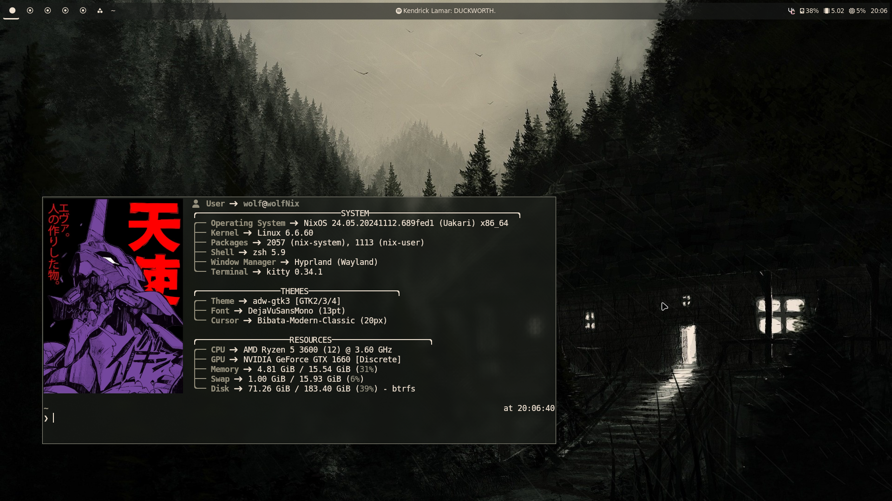
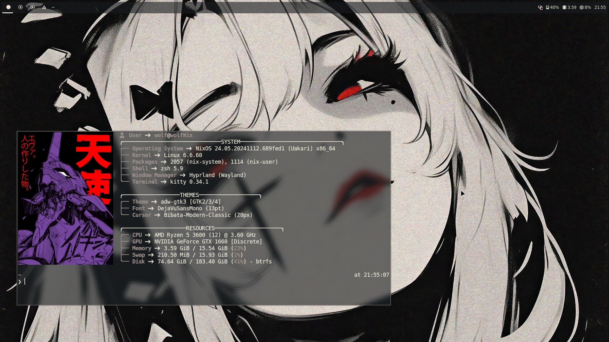
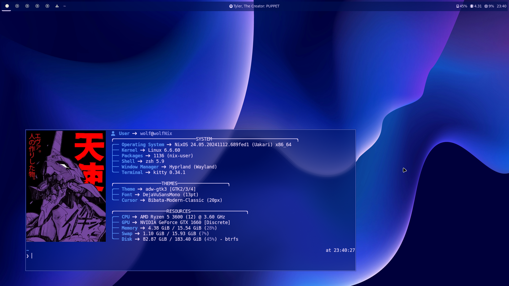
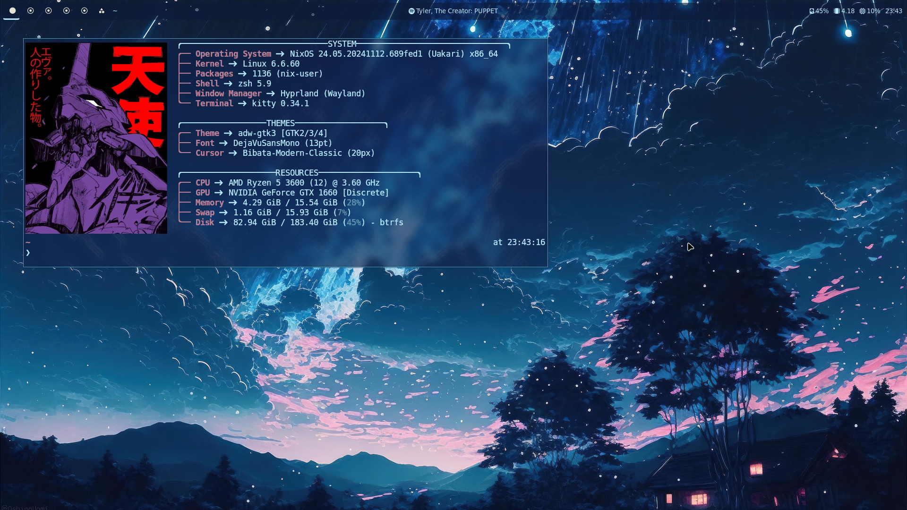
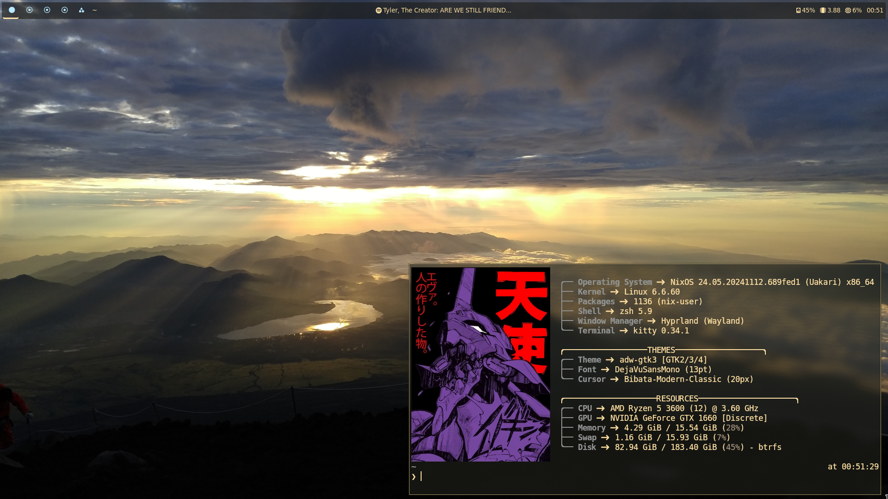

## my nixos configuration
- two hosts, #desktop and #laptop for both my systems (you guessed it, a desktop and a laptop)
- massive work in progress, but did work in a VM with some minor configuration changes
  (GPU drivers)
- NEW: moved to hyprland and supporting utilities like waybar and wofi
- TODO: figure out a simple installation script that automates the entire process, including
  hostname change
<hr>

#### how it works
- the flake (flake.nix) is the core of the system, responsible for creating the 
  #desktop and #laptop hosts
- the hosts directory contains configuration relevant for both hosts seperately,
  as well as modules common to both hosts
- i use nh, a wrapper around standard nixos tools that provides
  attractive progress updates during rebuilds
- rebuilding system changes:
```bash
nh os switch -H <host>      # same as nixos-rebuild switch --flake .#<host>
```
- rebuilding home changes:
```bash
nh home switch -c <host>    # same as home-manager switch --flake .#<host>
```

<hr>

#### installation
> **_NOTE:_** this is still pretty barebones, you'll need to modify a
  ton of stuff to get it to work for you. these instructions are also
  probably missing some integral steps, because i made this system
  over time instead of at once.
1. have a working nixOS installation.
2. `nix-shell -p git # vim if you need a good text editor`
2. `mkdir ~/.dotfiles`
3. `git clone https://github.com/eklavyasood/wolf-nixConfig.git ~/.dotfiles`
4. `cd ~/.dotfiles`
5. either generate `hardware-configuration.nix` or copy your own from
   `/etc/nixos/hardware-configuration.nix` into
   `hosts/<your host here>/hardware-configuration.nix`
6. modify `flake.nix` and change `userSettings` options to whatever you want for your
   setup.
7. `sudo nixos-rebuild switch --flake .#<host>`
8. `home-manager switch --flake .#<host>`

<hr>

#### theme previews

theming possible through stylix, a Nix project that
generates base-16 colorschemes whenever you rebuild your system/home configs,
and applies them to most applications.

more themes will be implemented whenever i stop being lazy about it.

- bleak-cabin


- white-black-red


- abstract-blue


- starry-night


- mount-fuji


<hr>

#### programs used
- [NixOS](https://nixos.org/)
- [Nix-Flakes](https://nixos.wiki/wiki/flakes)
- [Home Manager](https://nix-community.github.io/home-manager/)
- [Stylix](https://stylix.danth.me/)
- [NixVim](https://github.com/nix-community/nixvim)
- [zsh](https://zsh.sourceforge.io/)
- [Kitty](https://sw.kovidgoyal.net/kitty/)
- [Dunst](https://github.com/dunst-project/dunst)
- [Starship](https://starship.rs/)
- [Emacs](https://www.gnu.org/software/emacs/)
- [LazyGit](https://github.com/jesseduffield/lazygit)
- [Spicetify-Nix](https://github.com/Gerg-L/spicetify-nix)
- [spotify_player](https://github.com/aome510/spotify-player)

##### Hyprland
- [Hyprland](https://github.com/hyprwm/Hyprland)
- [Waybar](https://github.com/Alexays/Waybar)
- [Wofi](https://github.com/SimplyCEO/wofi)

##### bspwm
- [bspwm](https://github.com/baskerville/bspwm)
- [Picom](https://github.com/yshui/picom)
- [Polybar](https://github.com/polybar/polybar)
- [rofi](https://github.com/davatorium/rofi)
